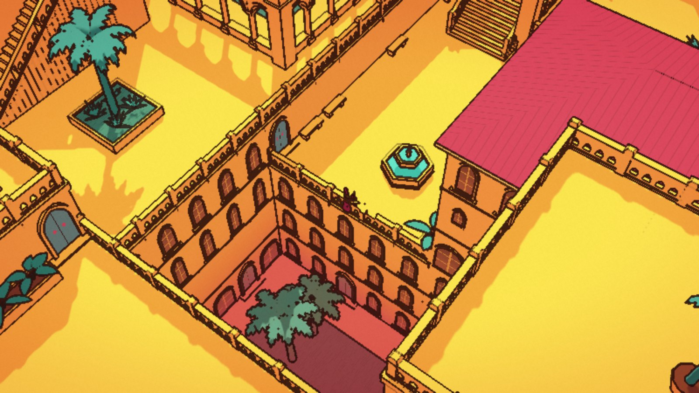

# Walks of Sennaar

An endless, procedurally generated walk through the sunlit terraces of the Devotees, in the style of *Chants of Sennaar*. There is no dialogue, notebook, inventory or puzzle, only the megastructure. It keeps going in every direction for as long as you want to walk.



## Running it

```sh
npm install
npm run dev       # http://localhost:5173
npm run build     # static site in dist/
npm test          # connectivity + walking checks (headless, Node 22)
npm run artifact  # dist/artifact.html + dist/assets/, for publishing as a claude.ai Artifact
```

`dist/` is a plain static site (relative paths). You can host it anywhere. `.github/workflows/pages.yml` publishes it to GitHub Pages on every push to `main`. For that to work, set the repository's **Settings → Pages → Source** to **GitHub Actions**.

Add `#seed-<number>` (or `?seed=<number>`) to the URL to walk a different world. The help panel (the **?** button) also has a link to a random one.

## Controls

| | |
|---|---|
| Walk | **WASD** / arrow keys, or **click** a spot (the traveller finds the way, stairs included) |
| Run | hold **Shift**, or **double-click** |
| Wander | hold the mouse button: the traveller walks towards the pointer |
| Turn the view | **Q** / **E** (45° steps) or right-drag |
| Zoom | mouse wheel, **+** / **−** |
| Touch | tap to walk, double-tap to run, hold to wander, two fingers to turn and zoom |
| Gamepad | left stick walks, right stick turns, bumpers rotate in steps, triggers zoom, **A** runs |
| Other | **M** toggles sound, **H** hides the interface |

## How it works

### The world

The world is an infinite grid of 64 m **blocks**. Each block has 32 × 32 cells of 2 m, and is generated on its own from `(seed, bx, bz)` inside Web Workers (`src/world/`):

1. **Districts.** Slow noise fields give each neighbourhood a character. *Relief* sets how steep it is, from broad plateaus to cascades of tall retaining walls. *Grain* sets how big the plots are, from dense lanes to open plazas. *Wetness* marks out the waterworks: there the set pieces run to canals, cascades and stepwells, sunken parterres become reflecting pools, and the wells of shade no path reaches fill with water.
2. **Set pieces.** About a quarter of the blocks are built around a centrepiece that is carved out before anything else. It can be a **stepped ziggurat** (two or three tiers, grand flights up its axes, and a domed pavilion, the sun idol or an obelisk on the summit). It can be a **sunken court**, two or three levels deep, crossed by a viaduct. It can be a **canal** with quays, mooring posts, wall spouts, grated culverts, bridges and crimson mitre lock gates with a winch on each quay. It can be a **stepwell**: two or three rings of terraces stepping down a level at a time to a tank of water, joined by broad ghats that turn a quarter at each level, with a domed pavilion or a plume fountain on an islet in the middle and devotees kneeling at the water's edge. Or it can be a **cascade**: two or three reaches of water, each a level below the last, that pour over weirs between banks stepping down beside them. Water comes out of a grated culvert at the head and drains into another at the foot, and some weirs carry a crimson sluice gate with a winding wheel. The same set piece never sits next to itself.
3. **Plots.** A BSP cut splits the rest of the block into rectangular plots. Each plot is a solid mass. Its top is a walkable terrace, a building with a hip, pyramid or flat roof (some flat roofs carry a drum and dome, and some towers a minaret with a corbelled gallery), or canal water. Broad plots may nest a raised dais or a sunken parterre inside a ring of terraces. Terrace heights come in 3 m levels, and one flight may climb up to three of them.
4. **Guaranteed connectivity.** Every block edge has a *gate* cell. Its level depends only on that edge, so the blocks on both sides agree on it. The gate levels around a block span at most two levels. This holds because the underlying height field is Lipschitz-bounded (see `anchorField`). A spine of plots links the four gates. It runs around any set piece, never through it, and its levels stay within a two-level band that holds every gate, so every step on the spine can be climbed. All other terraces branch off the spine as a tree. Afterwards the actual reach is flood-filled, and stairs are retried for anything that was cut off. Together, these rules make the walkable world one infinite connected region: you can never walk into a dead pocket. Stair placement also refuses any position that would cut a plot in two.
5. **Stairs.** Every level change on the tree gets a stair. It is either a straight flight into the lower terrace, a flight cut into the upper terrace, a split between the two, or a flight running along the retaining wall with a landing at the top. Flights that stand proud get cheek walls and sloped balustrades.
6. **Bridges.** Two terraces at the same level with open air at least two levels deep between them (or water) can be joined by a bridge. Bridges are a second walkable layer, the *deck*, so you can cross over a court and then walk through it underneath. Piers go where they fit best: on level changes and in water, as evenly as possible, never leaving a gap wider than 8 m. Each opening gets the tallest pointed arch that still leaves headroom, and flattens to a segmental one when it must. Some bridges have striped voussoirs and a horseshoe gate at each end.
7. **Furnishing.** Cloisters with arcades around lawns and quatrefoil pools. Hexagonal fountains, long basins with a row of jets, the golden sun-idol on its inscribed plinth, obelisks, domed pavilions, great pointed gateways, horseshoe arches with red and cream voussoirs, arcades along the drops, planters of agave and broad leaves, palm orchards, urns and benches. Some plazas get a **rill**: a narrow channel fed by a spout in a wall, crossed by stepping slabs at every cell so it never cuts the terrace in two. At a drop it spills through a scupper into a basin or canal below; otherwise it ends in a small basin with a jet. Walls rising from a terrace may carry a carved relief (devotees bowing to the sun, as a panel or a lunette) or a wall fountain pouring into a half-round basin. Terraces that no path reaches sink into deep courts (or, in wet districts, flooded wells fed by culverts). A sunken parterre in a wet district is a **reflecting pool** instead, its water just below the paving: a long one gets rows of jets arching in from both sides, a squarish one an islet with a plume.
8. **Walls.** Every retaining wall is a facade. It gets rows of pointed, twin, tall or blind-arched windows, carved friezes, balconies on corbels, cornices, string courses and doors (teal leaves with red diamonds). The pattern is chosen per wall and per storey, so each facade stays consistent.

Each block becomes a single merged mesh, with a compact vertex format (float positions, byte normals and a per-vertex material id). Blocks stream in and out around the traveller.

### The devotees

Each block also says where its devotees start their day (`src/npc/Crowd.js`). Most of them wander: they pick a spot a few metres away and walk there, stairs and bridges included, then stand a while or kneel. Some kneel before the shrines and bow now and then. Now and again a line of them walks the terraces in a slow procession, each following exactly in the leader's steps. They stop for the traveller and for each other, and turn their heads towards the traveller as it passes. Path searches are spread over frames (a small time budget each frame), and only devotees near the traveller move. All devotees are drawn with a few instanced meshes and cast shadows through their own shadow map, which uses the same light frame as the static one.

### The look

`src/render/` renders everything with one custom shader and a post pass:

- two-tone cel lighting from a fixed low sun, with cached static shadows plus a small dynamic shadow map for the traveller
- a palette per material: lemon floors, ochre walls, crimson roofs, teal plants and water
- water that keeps its teal however far below it lies. The shader draws it from a per-cell mask of the sides that meet stone: a jagged, lapping line of foam with flecks drifting off it, pale shallows over the footings, caustics and glints in the sun, and churning white below weirs and pouring culverts. Streaked sheets pour over the weirs
- a soft bloom around foam and jets, whose mask rides in the colour target's alpha
- fine etched hatching in world space, heavier in shade
- the game's signature gradient: surfaces turn from yellow through orange to magenta the further they lie below the traveller
- ink outlines from depth, normal and material discontinuities, plus paper grain and a warm vignette
- a see-through window cut into anything that hides the traveller

### Walking

Collision uses the block data directly. It combines floor heights and stair ramps, blocked edges (balustrades and stair cheeks), and circles and boxes for props. Where a bridge passes overhead there are two floors, and the current height decides which one applies. Click-to-walk runs A* on a 0.5 m lattice with a little clearance, smooths the result with line-of-sight checks, and re-plans if the traveller gets blocked.

### Checks

- `tools/connectivity.mjs [seed] [radius] [bx] [bz]` flood-fills the real collision model over a square of blocks. It verifies that every gate is reached, and reports any standable cell left unreached.
- `tools/walksim.mjs [seed] [trips]` plans random click-to-walk trips and simulates the traveller following them with the real movement code.
- `tools/crowdsim.mjs [seed] [seconds]` lets the devotees around the spawn live for a while and checks that nobody ends up off the ground.

The connectivity flood covers both layers, and it also fails if any bridge cannot be reached.

## Credits

A fan homage to *Chants of Sennaar* (Rundisc, 2023). No assets from the game are used: all geometry is procedural and every colour is picked by hand. Built with [three.js](https://threejs.org) and [Vite](https://vite.dev). MIT licensed.
